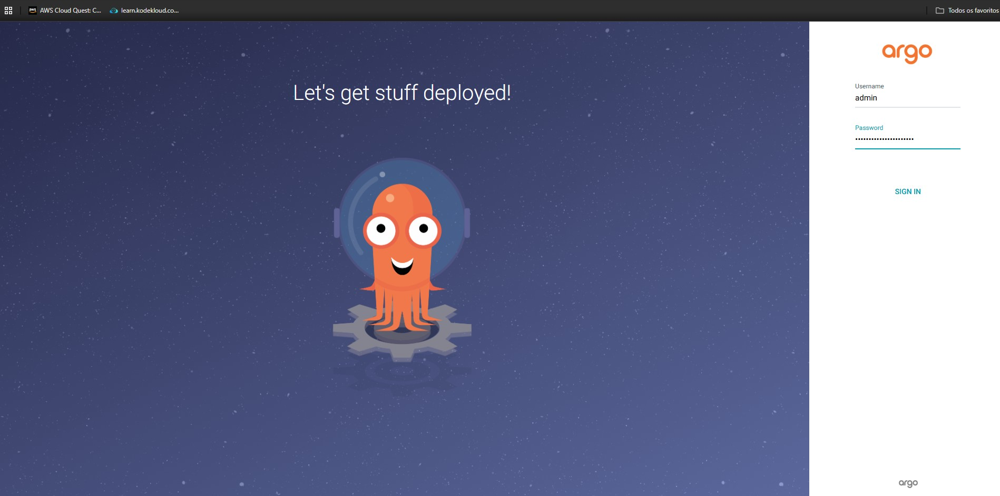
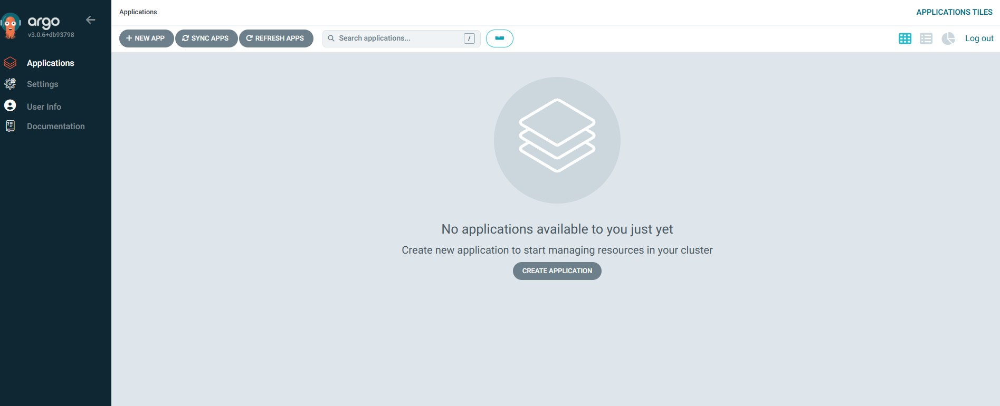
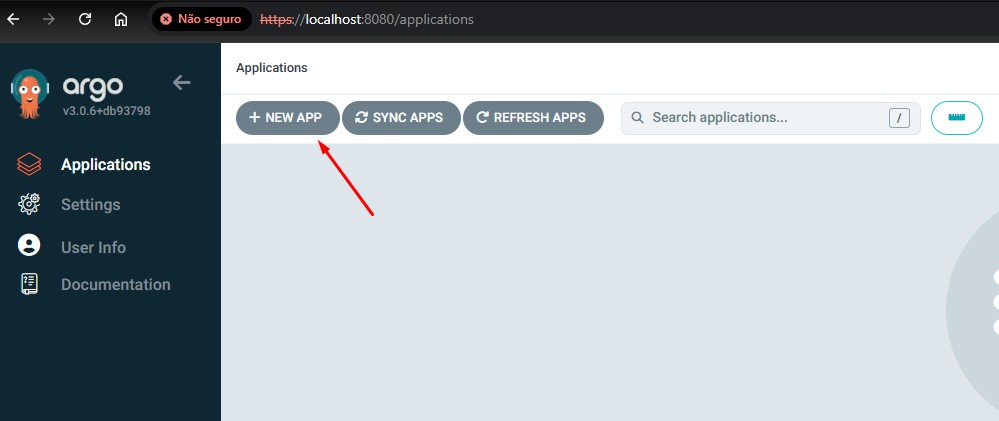
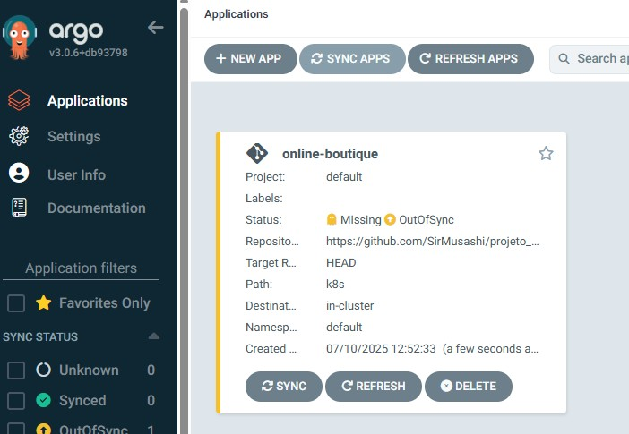
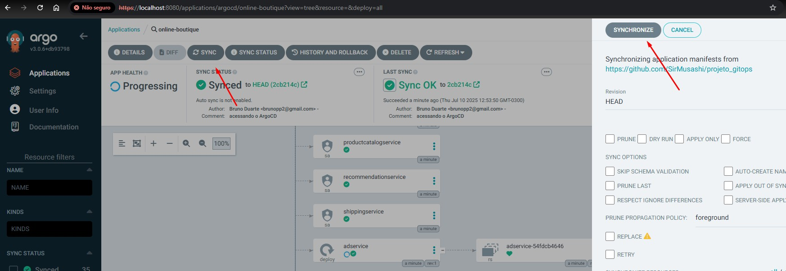
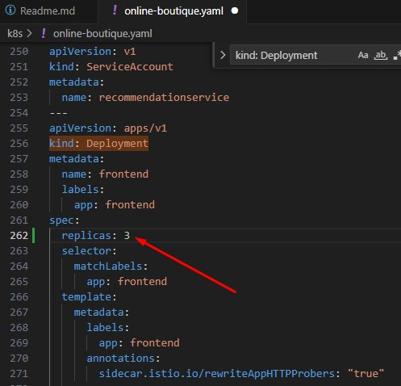
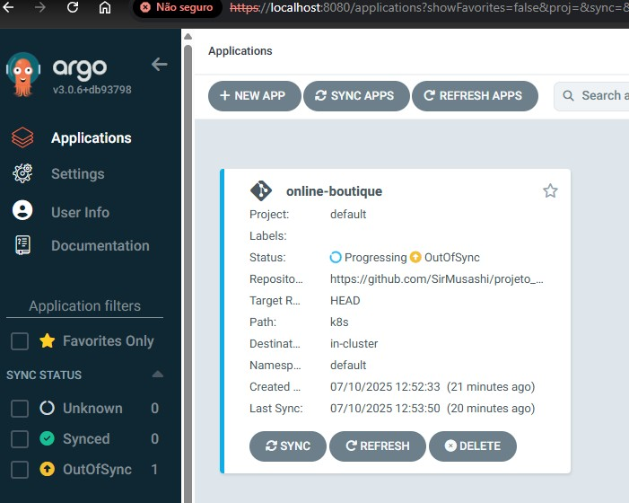
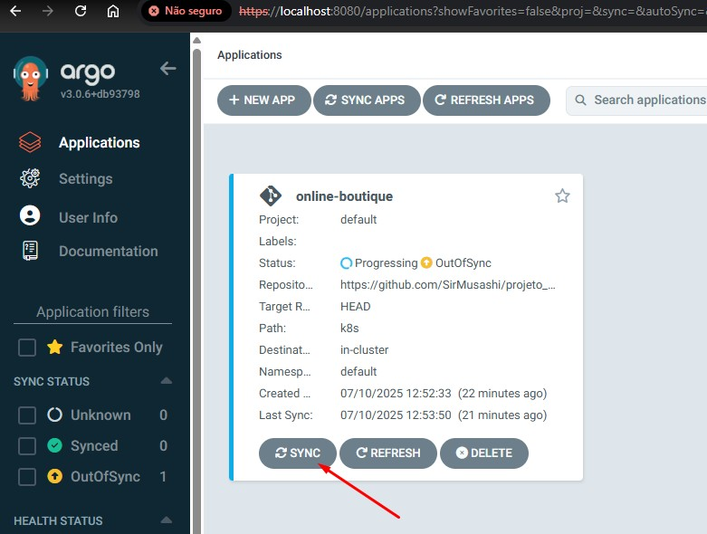
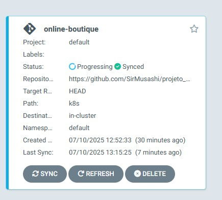
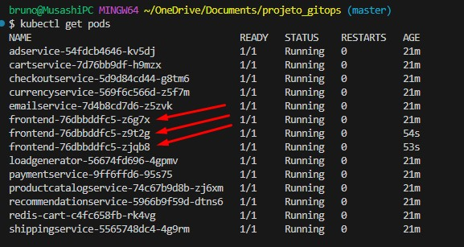

# Projeto GitOps na Prática: Online Boutique

## Este projeto, desenvolvido como parte do Programa de Bolsas DevSecOps da Compass UOL, demonstra a implementação de práticas GitOps para gerenciar uma aplicação de microerviços em um cluster Kubernetes local.

### O objetivo é implantar a aplicação "Online Boutique", um conjunto de microerviços, em um cluster Kubernetes local (gerenciado pelo Rancher Desktop). Todo o processo de deploy será controlado pelo ArgoCD, que utilizará um repositório no GitHub como única fonte da verdade, caracterizando a abordagem GitOps. 

**Tecnologias Utilizadas:**
* **Orquestração de Containers:** Kubernetes (via Rancher Desktop) 
* **Ferramenta de GitOps:** ArgoCD 
* **Controle de Versão:** Git e GitHub 
* **Aplicação:** Online Boutique (Microservices Demo) 

---

## Passo 1: Estrutura do Repositório GitOps

### O primeiro passo consistiu em preparar o repositório que servirá como fonte da verdade para nossa infraestrutura.

1.  Um *fork* do repositório oficial [GoogleCloudPlatform/microservices-demo](https://github.com/GoogleCloudPlatform/microservices-demo) foi criado para obter acesso aos arquivos de manifesto da aplicação. 

    

2.  Um novo repositório público, chamado `projeto_gitops`, foi criado para hospedar os manifestos que o ArgoCD irá monitorar. 
3.  Apenas o arquivo `release/kubernetes-manifests.yaml` do projeto original foi copiado para o novo repositório, seguindo a estrutura de pastas `k8s/online-boutique.yaml`. 

### Estrutura inicial do projeto:


---

## Passo 2: Instalação do ArgoCD

### Com o repositório GitOps preparado, o próximo passo foi instalar o ArgoCD no cluster Kubernetes local. O ArgoCD será o responsável por automatizar o deploy da aplicação.

1.  Um namespace dedicado foi criado para o ArgoCD, para manter seus componentes isolados:
    ```bash
    kubectl create namespace argocd
    ```
2.  Em seguida, o manifesto de instalação padrão do ArgoCD foi aplicado a partir da URL oficial do projeto:
    ```bash
    kubectl apply -n argocd -f https://raw.githubusercontent.com/argoproj/argo-cd/stable/manifests/install.yaml
    ```
3. Após isso rodei o comando `kubectl get pods -n argocd` e esperei tudo estar com **STATUS Running**

    

---

## Passo 3: Acesso à Interface do ArgoCD

### Com o ArgoCD instalado no cluster, o próximo passo foi acessar sua interface web. Como o serviço não é exposto externamente por padrão, foi utilizado o comando `kubectl port-forward`.

1.  Um túnel de comunicação foi criado entre a porta local `8080` e a porta do serviço `argocd-server` no cluster:

    ```bash
    kubectl port-forward svc/argocd-server -n argocd 8080:443
    ```
2.  A senha inicial do usuário `admin` foi extraída do secret `argocd-initial-admin-secret`:

    ```bash
    kubectl -n argocd get secret argocd-initial-admin-secret -o jsonpath="{.data.password}" | base64 -d
    ```
3.  O acesso foi realizado com sucesso através da URL `https://localhost:8080`.
    Com o login como `admin` e a senha `copiada do resultado do passo anterior` .

    

    

---

## Passo 4: Criação da Aplicação no ArgoCD

### O passo final da configuração foi criar a "Aplicação" dentro do ArgoCD, que conecta o repositório Git ao cluster Kubernetes.



### A configuração foi feita através da interface web do ArgoCD com os seguintes parâmetros principais:
- **Application Name:** `online-boutique`
- **Project Name:** `default`
- **Sync Policy:** `Manual`
- **Source Repository URL:** A URL do repositório `projeto_gitops` criado no GitHub.
- **Source Path:** `k8s`
- **Destination Cluster:** `https://kubernetes.default.svc` (o cluster local)
- **Destination Namespace:** `default`



### Após a criação, a aplicação foi sincronizada manualmente clicando em `SYNC`. O ArgoCD então aplicou os manifestos do repositório no cluster, criando todos os microserviços da aplicação "Online Boutique".



---

## Passo 5: Acesso e Validação da Aplicação

### Para acessar a aplicação, cujo serviço de frontend é do tipo `ClusterIP`, foi necessário criar mais um túnel com `port-forward`:

```bash
kubectl port-forward svc/frontend-external 8090:80
```

### A aplicação "Online Boutique" ficou acessível no navegador através do endereço `http://localhost:8090`.


---

## Passo 6: Validação do Fluxo GitOps

### Para validar o fluxo GitOps de ponta a ponta, foi realizado um teste prático de customização de um manifesto. O objetivo era alterar o número de réplicas de um dos microserviços diretamente no Git e observar o comportamento do ArgoCD.

### 1.  O arquivo `k8s/online-boutique.yaml` foi alterado, mudando o número de `replicas` do `Deployment` do `frontend` de 1 para 3.




### 2.  A alteração foi enviada para o repositório no GitHub com um `git push`.
    ```Bash
    git add .
    git commit -m "feat: Escala o microserviço de frontend para 3 réplicas"
    git push
    ```
### 3.  Automaticamente, a interface do ArgoCD indicou que o estado da aplicação estava `OutOfSync`, pois detectou a divergência entre o manifesto no Git e o que estava em execução no cluster.


### 4.  Após a sincronização manual no ArgoCD, a plataforma aplicou a mudança, e foi possível verificar que 3 pods do `frontend` estavam em execução no cluster, validando o ciclo completo do GitOps.







## Conclusão

### Este projeto permitiu uma imersão prática na cultura `GitOps`, demonstrando como o `Git` pode ser utilizado como fonte única da verdade para a infraestrutura e aplicações. Utilizando ferramentas como `Kubernetes` , `ArgoCD` e `GitHub`, foi possível implantar e gerenciar um ambiente de microserviços de forma automatizada, versionada, segura e resiliente, simulando como empresas modernas operam em ambientes cloud-native. 

# (: