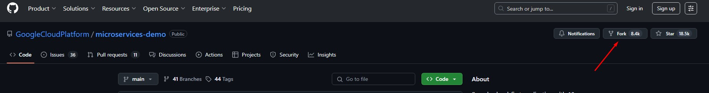
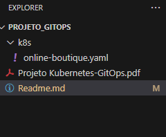
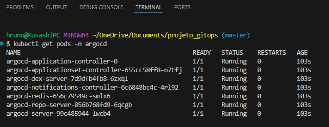

# Projeto GitOps na Prática: Online Boutique

## Este projeto, desenvolvido como parte do Programa de Bolsas DevSecOps da Compass UOL, demonstra a implementação de práticas GitOps para gerenciar uma aplicação de microerviços em um cluster Kubernetes local.

### O objetivo é implantar a aplicação "Online Boutique", um conjunto de microerviços, em um cluster Kubernetes local (gerenciado pelo Rancher Desktop). Todo o processo de deploy será controlado pelo ArgoCD, que utilizará um repositório no GitHub como única fonte da verdade, caracterizando a abordagem GitOps. 

**Tecnologias Utilizadas:**
* **Orquestração de Containers:** Kubernetes (via Rancher Desktop) 
* **Ferramenta de GitOps:** ArgoCD 
* **Controle de Versão:** Git e GitHub 
* **Aplicação:** Online Boutique (Microservices Demo) 

---

## Passo 1: Estrutura do Repositório GitOps

### O primeiro passo consistiu em preparar o repositório que servirá como fonte da verdade para nossa infraestrutura.

1.  Um *fork* do repositório oficial [GoogleCloudPlatform/microservices-demo](https://github.com/GoogleCloudPlatform/microservices-demo) foi criado para obter acesso aos arquivos de manifesto da aplicação. 



2.  Um novo repositório público, chamado `projeto_gitops`, foi criado para hospedar os manifestos que o ArgoCD irá monitorar. 
3.  Apenas o arquivo `release/kubernetes-manifests.yaml` do projeto original foi copiado para o novo repositório, seguindo a estrutura de pastas `k8s/online-boutique.yaml`. 

### Estrutura inicial do projeto:



---

## Passo 2: Instalação do ArgoCD

### Com o repositório GitOps preparado, o próximo passo foi instalar o ArgoCD no cluster Kubernetes local. O ArgoCD será o responsável por automatizar o deploy da aplicação.

1.  Um namespace dedicado foi criado para o ArgoCD, para manter seus componentes isolados:
    ```bash
    kubectl create namespace argocd
    ```
2.  Em seguida, o manifesto de instalação padrão do ArgoCD foi aplicado a partir da URL oficial do projeto:
    ```bash
    kubectl apply -n argocd -f https://raw.githubusercontent.com/argoproj/argo-cd/stable/manifests/install.yaml
    ```
3. Após isso rodei o comando `kubectl get pods -n argocd` e esperei tudo estar com **STATUS Running**

    